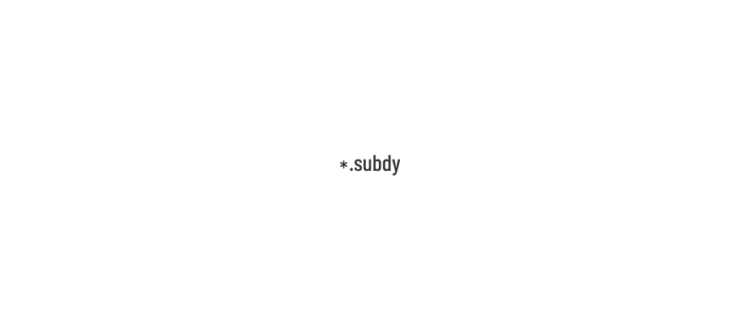

<p align="center"><a href="#readme"></a></p>

<p align="center">
  <a href="https://kaos.sh/w/subdy/ci"></a>
  <a href="https://kaos.sh/w/subdy/codeql"></a>
  <a href="#license"></a>
</p>

<p align="center"><a href="#screenshots">Screenshots</a> • <a href="#installation">Installation</a> • <a href="#usage">Usage</a> • <a href="#ci-status">CI Status</a> • <a href="#contributing">Contributing</a> • <a href="#license">License</a></p>

<br/>

`subdy` is a CLI for searching subdomains info using [subdomain.center](https://www.subdomain.center), [CertSpotter](https://sslmate.com/ct_search_api/), and [CIDRE](https://ctlogsearch.com) APIs.

### Screenshots

<p align="center">
  
</p>

### Installation

#### From source

To build the `subdy` from scratch, make sure you have a working Go 1.23+ workspace (_[instructions](https://go.dev/doc/install)_), then:

```bash
go install github.com/essentialkaos/subdy@latest
```

#### Prebuilt binaries

You can download prebuilt binaries for Linux and macOS from [EK Apps Repository](https://apps.kaos.st/subdy/latest):

```bash
bash <(curl -fsSL https://apps.kaos.st/get) subdy
```

#### Container Image

The latest version of `subdy` also available as container image on [GitHub Container Registry](https://kaos.sh/p/subdy) and [Docker Hub](https://kaos.sh/d/subdy):

```bash
podman run --rm -it ghcr.io/essentialkaos/subdy:latest mydomain.com
# or
docker run --rm -it ghcr.io/essentialkaos/subdy:latest mydomain.com
```

### Command-line completion

You can generate completion for `bash`, `zsh` or `fish` shell.

Bash:
```bash
sudo subdy --completion=bash 1> /etc/bash_completion.d/subdy
```

ZSH:
```bash
sudo subdy --completion=zsh 1> /usr/share/zsh/site-functions/subdy
```

Fish:
```bash
sudo subdy --completion=fish 1> /usr/share/fish/vendor_completions.d/subdy.fish
```

### Man documentation

You can generate man page using next command:

```bash
subdy --generate-man | sudo gzip > /usr/share/man/man1/subdy.1.gz
```

### Usage


### CI Status

| Branch | Status |
|--------|----------|
| `master` | [](https://kaos.sh/w/subdy/ci?query=branch:master) |
| `develop` | [](https://kaos.sh/w/subdy/ci?query=branch:develop) |

### Contributing

Before contributing to this project please read our [Contributing Guidelines](https://github.com/essentialkaos/contributing-guidelines#contributing-guidelines).

### License

[Apache License, Version 2.0](http://www.apache.org/licenses/LICENSE-2.0)

<p align="center"><a href="https://kaos.dev"></a></p>
